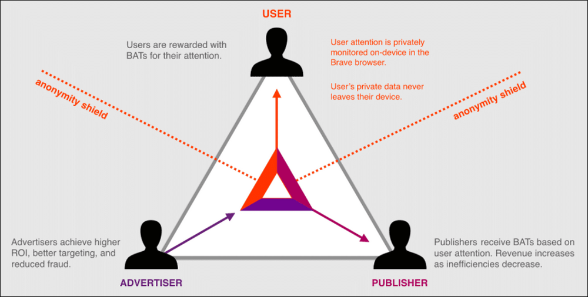
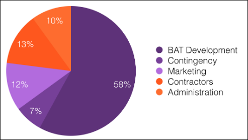

# Coin Guide: Basic Attention Token (BAT)?
## Intro

The Basic Attention Token is an ERC20 token seeking to disrupt and decentralize online advertising by removing middlemen from the equation. Instead the BAT team would like to see advertisers, publishers, and end users paying each other directly in a more useful and egalitarian way.

The advertising industry is currently using antiquated methods for reaching consumers that have become widely ineffective, and many times violate users privacy. The brute force methods that used to work on television and billboards are easily circumvented online.

In fact, people have become so fed up with ads that hundreds of millions now use ad blockers, reducing overall revenue for advertisers and their brands significantly. This loss of profit is a driving force for these agencies to seek other methods of generating income, often leading to the sale of users personal data.

To fix this problem BAT is directly integrated into the [Brave](https://brave.com/) browser. Brave is a privacy focused browser, available for all platforms, that blocks native ads and enforces some basic security best practices by default. The browser includes a built in wallet for BAT and tools to attract more users.

## Table of Contents

- What is BAT
  - Team members
  - What they're trying to accomplish
- How BAT Works
  - Technical info
  - Development status and future plans
- ICO & Token Supply
- How to Buy
- How to Store
- Conclusion

## What is BAT?
### Team Members

The team at BAT and Brave Browser are lead by founder, [Brendan Eich](https://en.wikipedia.org/wiki/Brendan_Eich). Brendan is known for co-founding the Mozilla project, creating the JavaScript programming language, and he is currently the CEO of Brave Software.

Brendan has attracted a team of individuals with similar experience and expertise. Among them are co-founder and lead engineer of the browser, Brian Bondy. Brian has also had a notable carreer, previously working at Evernote, Khan Academy, and Mozilla previously.

Following in the mission to respect users privacy, Yan Zhu was added to the team as a security and privacy engineer. Yan is known within the security community from her past work at HTTPS Everywhere, Privacy Badger, and Tor Project.

It is worth noting that the group assembled here is much more renowned than a typical cryptocurrency team. Almost every individual among them has a past worth mentioning. I'm not sure what has attracted all of this talent to one place, but it's a good sign that so many well respected people are clamoring to work here.

### What they’re trying to accomplish

Brave and BAT are trying to revolutionize the way that content is monetized and advertisements are delivered. They want to present these to users in a way which is intuitive and respectful of privacy.

In order to facilitate this the team have implemented many unique tools which help to create an ecosystem that lives within the browser. They hope that this will help to mend the one-sided relationship that exists between users and advertisers, where users are bombarded with ads and their private information is pilfered and sold.

## How BAT Works
### Technical Info

There are three components to the BAT ecosystem: advertisers, publishers, and users.
These are the main players in most marketing landscapes, but here BAT and Brave believe they have found an equilibrium in their co-existence.

Advertisers are self explanatory, they create the advertisements and buy either prominent website space or a content creators time. Typically users are annoyed by ads and pay little attention, which causes wasted income on ads that are ignored. To increase efficiency in that regard Brave gives advertisers an attention measuring system and tools for targeting ads.

Additionally, advertisers can reward users for spending their attention on ads with BAT. With targeted advertising this can actually be beneficial for both parties, because the user is much more likely to buy the item their being paid to learn about. 

The next group, publishers, are website owners and content creators. Websites will have banners or ads, and content creators can do product placement through various methods. Brave also acts as the exchange for publishers and advertisers using BAT as its currency.

Furthermore, the browser includes an analytics dashboard for each of the participants to fine tune their craft. This is designed to give advertisers and publishers a visual interpretation of their statistics to not only understand what has or hasn't been working, but to also project figures into the future with confidence.

The last member of the ecosystem is the end user, people that just want to browse the web. Brave strives to provide users with a more private browsing experience by blocking most ads. As you spend time on Brave, an anonymous profile will be built on you that allows for targeted ads. This is meant to be more personal and useful to users than a normal browser while also honoring their privacy.

Users can opt to not be shown any ads at all by using BAT to pay Brave. While that use case is not very interesting by itself, it does get exciting when you think about users getting paid BAT by advertisers for actually paying attention to their content. Now people have an incentive to watch ads, which are targeted to be interesting to you anyway.

The more that people are receiving BAT for creating content and watching ads, they will want to use it for something. The most obvious thing is exchange it on the market, but what the creators were hoping for was to create a closed economy. They hope that, once popular enough, even the products in the ads will be sold in BAT. This would greatly limit the necessity of exchange listings and promote further growth of the economy within the browser.

### Development status and future plans

As outlined in their [roadmap](https://basicattentiontoken.org/bat-roadmap-1-0/), over the remainder of 2018 the BAT team intend to continue improving their attention measuring algorithms and the accuracy of their targeted ads. Another goal is to get BAT integrated into other platforms such as other web browsers, communication, and social media apps.

Onboarding new users is a major hurdle for any cryptocurrency or web browser alike, and thus is a priority for these projects. They intend to achieve this via their donation of BAT to new users from the "[User Growth Pool (UGP)](https://basicattentiontoken.org/faq/#UGP)", and creating revenue for content providers and advertisers through the use of these donated tokens.

In an effort to increase privacy for users of the system, zero knowledge proofs (ZKP) are yet another plan in the works. ZKP will allow for token transfers which hide sender, receiver, and amounts from the blockchain.

## ICO & Token Supply

The BAT tokens ERC20 [contract](https://etherscan.io/address/0x0D8775F648430679A709E98d2b0Cb6250d2887EF) was created on May 30, 2017, producing 1,500,000,000 BAT. The next day the team held their ICO where, of the total 1.5B supply, 1B tokens were sold at a rate of $0.04/ea or 6,400 BAT for 1 ETH.

They raised a total of 156,250 ETH, worth an estimated $35,000,000 at the time. These funds are allocated for various necessities of a company such as contractors, administration, team members, and unforseen costs.

The remaining 500M BAT tokens are split up between the UGP ([300M BAT](https://etherscan.io/token/BAT?a=0x7c31560552170ce96c4a7b018e93cddc19dc61b6)) and the development team pool ([200M BAT](https://etherscan.io/token/BAT?a=0x67fa2c06c9c6d4332f330e14a66bdf1873ef3d2b)). The development team pool has a 180 day time lock on 60% of the tokens, while 66M are already available.

## How to Buy

The BAT token can be bought on most [exchanges](https://coinmarketcap.com/currencies/basic-attention-token/#markets). The are over 50 trading pairs, which means the token can be exchanged for many cryptocurrencies, fiat currencies, or other tokens.

## How to Store

Since BAT is an ERC20 token, any Ethereum supporting wallet should be sufficient for storing and transacting. This also includes hardware wallets like Trezor and Ledger.

In addition, the Brave browser has a native wallet which can be used to set up payments based on attention given to multiple parties or services while web browsing. This is where you can claim your free tokens as a new user from the UGP.

## Conclusion

BAT and Brave are a unique idea that is trying to revolutionize an industry that desperately needs it. The methods that used to work to successfully market products are no longer relevant, and in some instances create the opposite of their intended effects.

As our society spends more and more time interacting online, we are also becoming more efficient at routing around inconvenience and protecting our privacy. To give our attention we must be truly engaged by either the presenter or the product. This is why targeting the correct product, in a way that respects privacy, is so important.

At this early stage there's no way to know if this is the right solution to the problem, but at the very least it is a step in the right direction and possibly a glimpse into what the future of marketing may look like.
