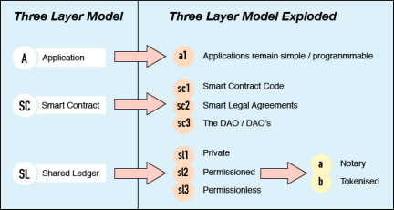
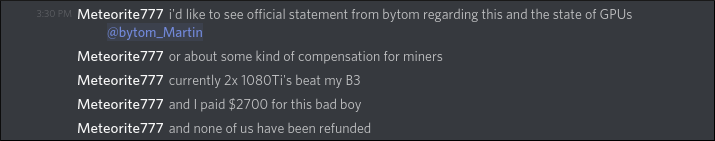
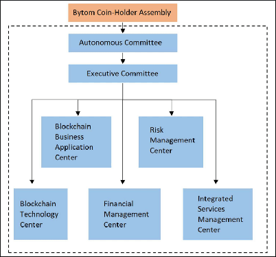
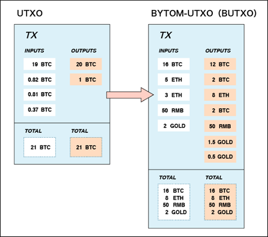
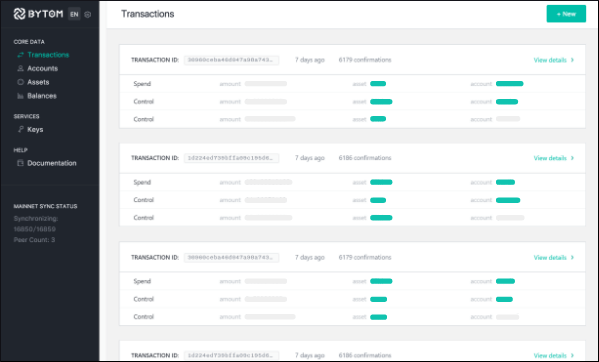

# What is Bytom? | The Ultimate Beginners Guide

## Intro

Bytom (BTM) is an open source blockchain protocol for tokenizing digital and real world assets such as currencies, securities, dividends, and bonds. Any information can be registered on the Bytom chain. Once digitized, the information can then be exchanged, gambled, or engaged in a more complicated, smart contract-based manner.

The [announcement](https://bitcointalk.org/index.php?topic=1975390.0) for Bytom was made on the day their public ICO began, June 20, 2017. In one month they were able to raise 8,400 BTC worth $22,554,000. 630M BTM coins were distributed this way, with another 777M BTM sold privately for an undisclosed amount.

Bytom's max supply is 2.1B BTM; 77% of which has already been distributed in the form of ERC20 tokens on Ethereum's network. On April 24, 2018 the Bytom wallet and mainnet launched, making it possible for holders of the ERC20 placeholder to swap them for real BTM on the main network.

## Table of Contents

## What is Bytom?
### Snapshot

### Team Members

Bytom was founded by Duan Xinxing and Chang Jia. Duan is the former Vice President of the OKCoin exchange, and has lead other successful blockchain projects. Chang is a renowned science fiction writer and one of the co-founders (along with Jihan Wu of Bitmain) of [8btc](http://8btc.com/), China's top source for cryptocurrency news and discussion.

Working with Chang and Duan is a young, professional [team](https://bytom.io/team/). Most of the senior talent was brought over from 8btc, and there are about 30 individuals with varying skill sets working under them.

### Goals

Bytom's goal is to act as the bridge between physical and digital business world by creating an open platform which registers real world assets. The team's hope is that they can standardize the creation and definition process of digitizing assets in a user friendly way.

In an [interview](http://news.8btc.com/what-is-bytom-and-its-business-model), founder Duan Xinxing had this to say about Bytom's aims:
> More and more digital assets will emerge in the future. Bytom bridges physical word and byte world for multiple digital assets, promoting the registration, circulation and exchange of various digital assets.

Bytom strives to become a trusted network to those using their platform by providing three major services. First, the team itself will conduct paid due diligence investigations on all assets and projects that are to be listed on Bytom. The second thing the team will provide is both free and paid services to aid the flow and exchange of assets. Lastly, upper layer applications will be continually developed with the benefit of the entire ecosystem in mind.

## How Bytom Works
### Technical Info

There are three layers to Bytom's architecture, which are the Application Layer, the Contract Layer, and the Shared Ledger Layer. In an effort to streamline the process of digitizing assets, the team has segregated the Application Layer and tried to keep the tools simple.

The Application Layer is where end users will interact with the network. Using tools such as wallets, users can trigger actions on or make forecasts from the Contract Layer. The Contract Layer has two types of contracts: Genesis Contracts and General Contracts.

Genesis contracts create and validate the actions of smart contracts on the network. They are responsible for enforcing the standardized protocol rules. General Contracts perform a couple functions, the first is to provide the framework for transferring assets between users. The second is to deploy new assets by first getting approval from the Genesis Contract.

The Shared Ledger layer is the blockchain that we're all used to. This is the historical log of all transaction data that has occurred on the Bytom Blockchain. This is the layer which keeps track of all balances and is secured with mining.

### Mining/Consensus

Bytom's mining situation is an interesting story. The founders plan was to create a Proof-of-Work algorithm that could only be profitably mined by ASICs, specifically the Antminer B3 from Bitmain. The idea behind this, according to their [Technical White Paper](https://bytom.io/wp-content/themes/freddo/book/BytomWhitePaperV1.1_En.pdf), was to give the hardware a purpose after mining was no longer feasible. Once that time came, the B3 miner could then be re-purposed for use in AI acceleration.

Here is what founder Chang Jia said when questioned about the ASIC only algorithm in and [interview]():
>The proposal of AI ASIC-friendly consensus algorithm is a major innovation of Bytom network. Bitcoin ASIC miners could only perform hashing computation, which is a potential waste in the arms race. Bytom can be directly integrated on existing ASIC chips for mining. This is a win-win situation for AI industry and blockchain industry.

On April 25th, the day after the Bytom mainnet launched, Bitmain put the B3 for sale at $2,600. 25,000 units sold out almost immediately, with the promise of 750 hashes per second. However, once the units started to arrive at customers the reported performance was only around 500-600 hashes. The frustration of Bitmain's customers only became worse as more users started bringing their new units online and the rewards started dropping to about 20-30 BTM ($12-$20) per day for each miner.

Then, things became even worse in May. First, the ASIC only algorithm that was designed for Bytom was [cracked](https://bitcointalk.org/index.php?topic=3921500.0). This allowed GPU miners to jump onto the network, driving the global hash rate up and lowering everyones rewards to about 10 BTM per day for each ASIC. The next hit came once it became clear that the GPUs were actually outperforming the ASICs! Two 1080Ti graphics cards, which cost only [$1,600](https://www.amazon.com/MSI-GAMING-GTX-1080-TI/dp/B0722YBZGK?th=1), can beat a B3. The ASIC customers felt shorted to say the least.

A snippet of a miner complaining on Bytom's Discord:

### Governance Structure

The management structure for Bytom, as outlined in their [Economic White Paper](https://medium.com/@Bytom_Official/bytom-economic-white-paper-e027ac5ac139), is designed to be similar to corporate governance. The team have decided on a three tier system which includes the Bytom Coin-holder Assembly, the Autonomous Committee, and the Executive Committee.

These groups form a hierarchy with the Bytom Coin-holders Assembly at the top. The Coin-holders Assembly has the most authority in the system and is comprised of all the holders of BTM tokens. Every token holder has the right to vote on the actions of the Assembly.

The Autonomous Committee is tasked with electing members to the Executive Committee and overseeing their work. The Autonomous Committee answers directly to the Coin-holders Assembly.

The Executive Committee are the ones responsible for the day to day matters of the Bytom Blockchain. Their tasks include creating and maintaining a number of management centers that handle things such as technology development, risk management, and integrating services.

Furthermore, the team plans to establish a Bytom Foundation which will operate outside of China. Their duty will be to serve as the governing body to the Bytom Blockchain. They will provide services to shareholders, standardize procedures, protect the rights of coin holders, and market the brand.

### Transactions

The BTM token is designed to have three uses: transaction fees for asset trading, dividends of income assets, and deposits for asset issuance. There are currently three types of assets on the Bytom Blockchain: income assets, equity assets, and securitized assets.

Each of these asset classes are defined in Bytom's white paper. Using BTM tokens, users can trade or sell ownership and redeem value from these real world assets on Bytom's blockchain. In order to accomplish this technically, the developers had to modify Bitcoins transaction model (UTXO) to create their own (BUTXO) which has support for these physical properties.

In an effort to address scaling concerns, the Bytom team has decide to modify another one of Bitcoin's inventions: Segregated Witness. This simply means that once a Bytom transaction is verified and executed, the data that is produced in verification can then be discarded.

### Future plans

Having just launched their mainnet a month ago, Bytom has just about everything yet to do. The first step is to establish the Technology Committee and come up with a long-term development strategy. This committee will review all code change proposals and have a vote before any changes are made.

The next focus will be to stay one step ahead of scaling problems. The Bytom team wants to have solutions in place before the demand for expansive use. Since they have implemented a version of SegWit, Bytom's developers will be able to use a modified version of the Lightning Network which supports multiple assets. This will allow for small, repetitive transactions to happen in milliseconds for almost no cost on a second layer.

Once the Lightning Network is operating on Bytom, the team intends to add cross-chain atomic swaps. This is a wonderful feature that be done using the payment channels that lightning needs. It allows for users of different cryptocurrencies to swap with each other in a P2P, trustless, and decentralized way.

Beyond that, Bytom plans to expand their ecosystem in general by investing money and marketing. Then, once they find some actual users, they'll need to bootstrap the entire process of digitizing assets. This will no doubt be a significant amount of work since one of their goals is to do due diligence investigations of each asset on their chain.

## Pros/Cons
### Pros

+ Founders with deep roots in the Chinese cryptocurrency space.
+ Partnered with some extremely influential companies.
+ Raised a lot of money through public and private pre-sales, should be self sufficient for a while.

### Cons

+ More than 3/4 of coins sold through public and private ICO, leaving little for mining incentive.
+ Some of the projects direction seems to be heavily influenced by their business partners.
+ The fact that they could not get their mining algorithm right is worrisome.
+ Smart contracts and digital assets are already being done on other chains which are more established, especially in China.
+ The team have put a lot of continuing responsibility on themselves beyond just code development and security.

## How to Buy

Buying Bytom at the moment is not so easy unless you are in China. However there are some exchanges which cater to customers from outside the country. Taking a look at the list of [exchanges](https://coinmarketcap.com/currencies/bytom/#markets), I see a few right away that customers from almost any country can use: Bibox, Cryptopia, and HitBTC.

You may need to verify, using a passport in some cases, depending on your daily withdraw needs. Always be sure to check the terms before depositing funds on a new exchange.

## How to Store

How you hold your BTM tokens depends on whether you have the ERC20 tokens, or the real BTM tokens. Anyone that bought in the ICO received ERC20 placeholders, which can be stored in any wallet that supports ETH.

Since the mainnet has launched the ERC20 tokens can now be traded for the true BTM token. There is no deadline in place to do the swap, though, and because of this exchanges and users have been slow to follow through with it. Interestingly, this is causing another issue because almost every exchange only accepts the ERC20 token yet the miners are earning the real token. Leaving miners with only one exchange to sell on, which does not allow customers from the US.

Once most ERC20 tokens have been swapped, the exchanges will start using the main chain. At that point, or if you are mining now, you can use the [wallet](https://bytom.io/wallet/) from the Bytom team.

The official wallet is simple and well designed. Some of the available features are an HD seed for easy backup, ability to create multiple accounts and addresses, and interacting with digitized assets and contracts.

## Conclusion

With over $20M in funding, more than 30 members on their prestigious team, and the backing of some of the most powerful players in all of cryptocurrency, Bytom seems to have secured a bright future for themselves. All of these facts combined with a structured business and governance model which was designed by individuals with experience and success in this industry, gives one confidence that their goals will be attained.

If they are to be successful in digitizing physical assets they may need to directly compete with the likes of Ethereum and NEO, which is a daunting task to say the least. Nonetheless, it may turn out that there's a special niche for strong KYC/AML situations that Bytom's due diligence promise can give them an edge over the competition on.

Whatever happens, it's pretty obvious that Bytom's time is just beginning. We'll just have to wait and see how the blockchaining of physical assets plays out and which team's method has the most success and adoption going forward.

