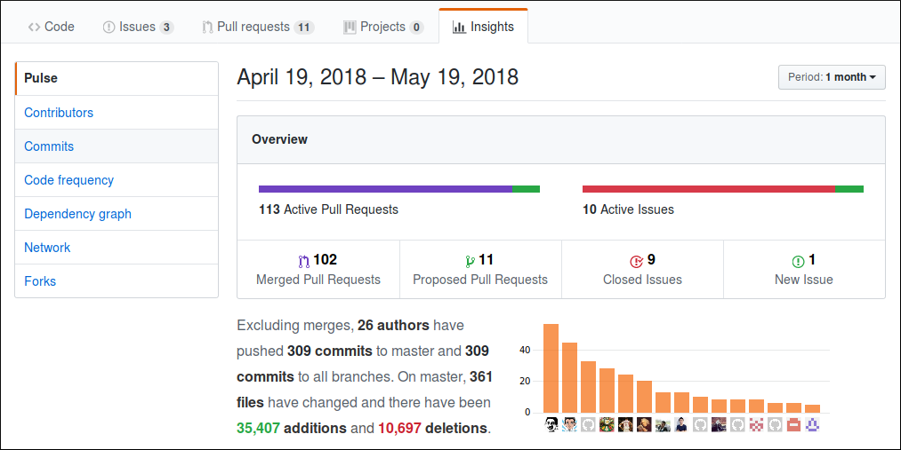
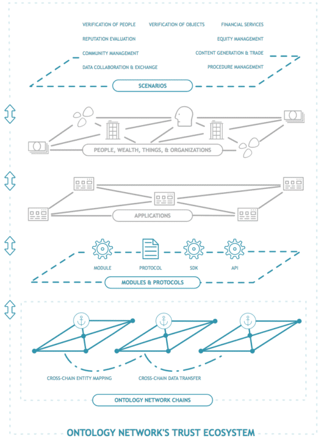
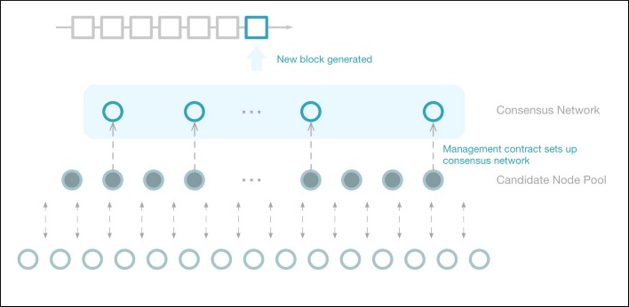
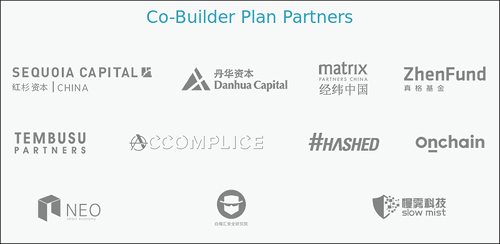
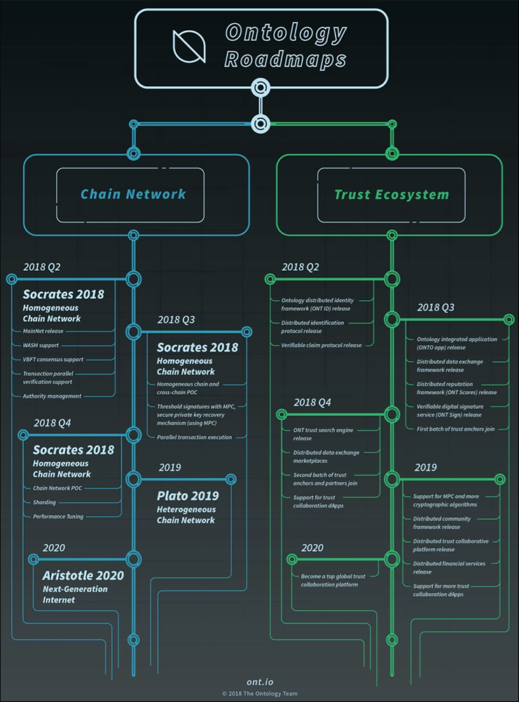
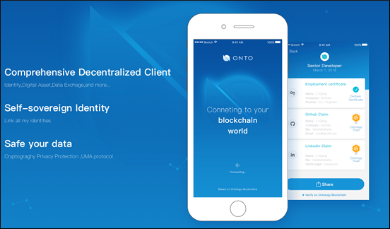

# What is Ontology? |

## Intro

Ontology (ONT) is a smart contract ecosystem designed to revolutionize the way we deal with identity verification by anchoring this data to a blockchain based network. Building upon lessons learned from cryptocurrencies like Bitcoin, the founders of Ontology want to bring reduced counter party risk, improved security, and the benefits of distributed systems to identity management.

Ontology was launched in November 2017 by the Chinese company Onchain. At the moment, ONT exists as a NEP-5 token on the NEO blockchain as Ontology is still running on their test network. The main network will launch by the end of this quarter. Once the mainnet is operational, all ONT NEP-5 tokens will be transfered to ONT on Ontology's network.

ONT tokens are still in the community distribution phase with one round completed and the second set for after mainnet launch. A little over 114 million tokens have been distributed so far. According to Ontology's distribution [plan](https://medium.com/ontologynetwork/ontologys-ont-token-distribution-and-circulating-supply-da96d5540827) there should be another 6 million given out in the second round.

Although Ontology's network is still in testing, ONT tokens are already being traded on exchanges. Between March and May of 2018 ONT saw a 1,000% increase in value, going from around $1 to over $11. For the past few weeks the price has been experiencing a correction with a slow and steady drop in value.

## Table of Contents

+ What is Ontology?
  - Snapshot
  - Team
  - Goals
  - Place in Industry
+ How Ontology Works
  - Technical Info
  - Mining/Consensus
  - Transactions
  - Partnerships
  - Future Plans
+ Pros and Cons
+ How to Buy
+ How to Store
+ Conclusion

## What is Ontology?

### Snapshot

| Date | May 15, 2018 |
|-----|--------|
| Age | 2 months |
| Marketcap | $905.91M
| Price (USD) | $7.90
| Price (BTC) | 0.00093฿
| All Time High | $11.06
| ATH Date | 05/03/2018
| Down From ATH | 28.53%
| Available Supply | 114,637,101
| Total Supply | 1,000,000,00
| Inflation | fixed supply
| Website | https://ont.io/
| Explorer | [neotracker](https://neotracker.io/asset/ceab719b8baa2310f232ee0d277c061704541cfb)
| Github Repo | https://github.com/ontio

### Team

The founder and lead architect of Ontology is Jun Li. Li has a background in computer science and business with work experience in financial exchanges. Working with Li are over 60 members in the core group, giving Ontology one of the largest [teams](https://info.ont.io/team/en) I've ever seen at a single blockchain project. The individuals on the team all have impressive backgrounds and consider themselves to be experts in a range of fields including blockchain tech, distributed application development, business management, marketing, and global finance.

Before coming together as Ontology, members of the core team have been a part of other successful organization such as IBM, Cisco, along with other large financial, big data, and internet companies. This large group with diverse backgrounds gives Ontology a wealth of knowledge and multiple areas of expertise.

This can be seen directly when looking into their development process on [Github](https://github.com/ontio). Teams typically have one or two developers that do most of the coding, and maybe a handful of others that pitch in every so often on remedial tasks. Ontology, on the other hand, has a robust set of 16 developers that account for a majority of contributions. Over the last month 26 authors have contributed code to the core software, showing a strong effort from the community as well.

### Goals

Ontology aims to use cryptographic methods and distributed blockchains to facilitate proving identification in a more secure and efficient way. The team hopes to solve fundamental problems with proving identification that are a result of the old methods that we still use which were invented long before these new technologies.

As one example, consider going to a bar and proving your age with you ID. The person that verifies your birth date could also retain other information, such as your address. If the establishment scans the ID electronically, all of your information is stored and possibly sold to third parties.

It is this type of inefficiency, and unnecessary exposure, that Ontology hopes to eradicate by moving ID information onto their blockchain. Ontology understands that optimizing identification verification is a crucial step in order to begin a new era of decentralized digital business.

### Place in Industry

As I mentioned, Ontology is still in testing, with mainnet launch just around the corner. This means that right now all Ontology tokens exist as NEP-5 placeholder tokens on the NEO blockchain. However, once the mainnet is live, Ontology will operate entirely on its own network.

This leaves some to wonder if Ontology will become a direct competitor to NEO in the future. Especially considering the fact that Da Hongfei is both the CEO of Onchain and the co-founder of NEO, it would be very strange for them to compete with each other.

It is exactly because of this possible conflict of interest that NEO and Ontology signed a [memorandum of understanding](https://medium.com/ontologynetwork/ontology-and-neo-sign-mou-concerning-strategy-and-technology-e78d08279955) on May 14, 2018. The agreement is that NEO will provide the base functionality of a smart economy along with Ontology focusing on identity and trust issues. The two separate chains will cooperate with each other and share resources where possible.

## How Ontology Works
### Technical Info

Ontology has decided to concentrate their efforts on two technical aspirations, the first being the Chain Network. This is the underlying protocol of Ontology which provides the foundation for the rest of the system. The Chain Network will handle things such as the consensus algorithm, communication protocol, security, and scaling.

The second focus of the project, the part which most users will be interacting with, is called the Trust Ecosystem. This mechanism will offer the opportunity of bringing real world identities onto the blockchain. The team believes this will serve two purposes, the first is to put an end to theft of this type of data, and the second is empowering users to have more control over how their information is shared.

The Trust Ecosystem will be divided up into four chains that remain separate, but still have the ability to share information. The first chain will be used for verification of people and their property. The next chain's is to verify the authenticity of applications we interact with to prevent credential stealing attempts by cloned sites or apps. The third chain can make sure that the actual protocols and tools used to communicate over the internet are not malicious. Finally, the fourth chain provides a reliable way to look up and share the information from the other three chains.

For businesses and developers to appreciate the benefits of a smart contract blockchain, they first need to know how to create and use smart contracts. With Ethereum, the most popular smart contract platform, this is done using the Solidity coding language. Solidity was written specifically for Ethereum and presents a significant learning curve to most developers.

The team at Ontology wanted to make it easy for any coder to work on their platform. In order to do so, they created a smart contract tool called SmartX. SmartX allows users to compile, set up, and invoke contracts in two of the most popular coding languages, C# and Python. In the future Java, JavaScript, Go, Rust, and other popular languages will be added.

### Mining/Consensus

In an interesting move, Ontology has decided to invent their own consensus algorithm: Verifiable Byzantine Fault Tolerance (VBFT). VBFT combines aspects of Proof-of-Stake, [BFT](https://en.wikipedia.org/wiki/Byzantine_fault_tolerance), and [VRF](https://en.wikipedia.org/wiki/Verifiable_random_function). This consensus algorithm was chosen to increase performance and efficiency in order to support the next generation of blockchain applications.

VBFT may seem complicated and technical, but it is a fairly simple system. For each consensus round three distinct groups of nodes are chosen, using a verifiable random function, from the pool of candidates on the Ontology network. The first group of nodes will be selected to each submit a proposed block. The next group of nodes is chosen to verify all proposed blocks and vote on the highest priority candidate. Then, the third group of nodes verifies the voting and determines the final result which is written to the blockchain and spread throughout the network.

Ontology has not revealed whether or not nodes will receive a reward for participating in consensus. However, considering that one must lock up funds as stake to be in the pool of candidate nodes, it is unlikely that there will be no incentive structure.

### Transactions

At the moment, Ontology is also being tight lipped on exactly how their transactions will work on mainnet. One thing we know for sure is that the team have decided on a two-token system, ONT and ONG. ONT will be indivisible, but ONG will be divisible.

The system will operate just like NEO's two-token system. ONT will be the token which will give access to participation in governance and consensus. Whereas ONG will be the "utility token," consumed during the execution of smart contracts.

Until the team releases more information on the specifics of transactions, it is unclear what the fees will look like. Taking into consideration how much Ontology has borrowed from NEO, it may be safe to look at [NEO's fees](http://docs.neo.org/en-us/sc/systemfees.html) to get an idea of what Ontology may do.

### Partnerships

Recently Ontology announced the foundation of the "Co-Builder Plan Partners." It is a group of businesses that all wish to see the success of blockchain based systems. Their plan involves supporting each other in various ways to foster growth, development, dissemination, and construction of blockchain infrastructure.

At this early stage in its development, there are about a dozen partners in the group. Mostly capital investment businesses, NEO is there as the only other blockchain business, and then there are two security companies. Hopefully this list will continue to grow and diversify over time, because it has the possibility of making a positive impact on the future of this ecosystem.

### Future plans

In the immediate future Ontology's goals on the Chain Network are to launch the mainnet, ensure support for their smart contract execution, complete ONT token distribution, and implement the VBFT consensus. By the end of 2018 they hope to have cross-chain communication, threshold signatures with a private key recovery mechanism, and further performance tuning.

As for the Trust Network's short term, the team will have their distributed identity system (ONT ID) operational and its protocol released. Later in the year is when the project really begins to take shape. In Q3 and Q4 some of the key developments we will see the release of integrated applications, data exchange marketplaces, reputation systems, and trust search engines.

## Pros/Cons
### Pros

+ Large team made up of well educated and experienced professionals.
+ Backed by major Chinese companies and well funded VCs.
+ Strategic partnership and shared resources with NEO.
+ A possibly extensive use case, specifically in their country of origin.

### Cons

+ Mainnet hasn't launched, and there is no working identity system yet.
+ Chinese government may take action if they feel their own identity/reputation system is threatened.
+ Could end up as competition to NEO in the long run.

## How to Buy

Ontology is traded on a few more than 10 different [exchanges](https://coinmarketcap.com/currencies/ontology/#markets). The largest exchange by ONT trading volume is [OKEx](https://www.okex.com/market?product=ont_btc), but the most popular market to list the token is [Binance](https://www.binance.com/trade.html?symbol=ONT_BTC). The most frequent trading pairs are BTC, ETH, and USDT.

## How to Store

With ONT being a NEP-5 token, it can be stored in wallets that support NEO. The most popular wallets among holders are [Neon Wallet](https://github.com/CityOfZion/neon-wallet/releases), Ledger Nano S, and Trezor.

The Ontology team is building their own client, [ONTO](https://github.com/ontio/ONTO), that is set to be released in the third quarter of this year. ONTO will finally allow users to realize a use case for ONT outside of prospective trading. More than just a wallet, ONTO will provide users the tools to store and stake tokens, search and extract information from the blockchain, and interact with their own digital identity.

## Conclusion

Ontology intends to solve an interesting problem, one that any person who has had to prove their identity over the internet is familiar with. The process usually entails scanning all the documents an identity thief would love to get their hands on and then transmitting them over the internet. The documents will end up at a company that will store them indefinitely using often insufficient security measures.

On the other hand, the Ontology developers also need to make users security their first priority. The code must remain open source and needs to be thoroughly peer reviewed to root out bugs and backdoors. Development needs to be diverse with checks and balances put in place to allow for new contributors but at the same time protect against bad actors. These are no small tasks, if a single developer turned out to be malicious, or just incompetent, someone could walk away with a treasure trove of data.

If government ID systems do successfully become decentralized, or added to a distributed network that is not subject to the laws of any one country, it would serve to increase trust over the internet. Ontology's success could open the door to things like getting verified for a top tier exchange account in an instant, applying for credit at a Swiss bank from your couch in the US, or simply proving your age at a bar without letting the bouncer know where you live.

